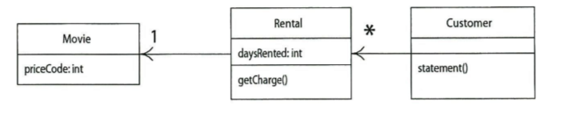

# 1장. 맛보기 예제

## 01. 원래의 프로그램

1 .기존 프로그램의 문제

* 문제 코드
  * ```java
    class Customer{


       public String statement(){
   
           double totalAmount = 0;
           int frequentRenterPoints = 0;
           Enumeration rentals = _rentails.elements();
           String result = getName() + "고객님의 대여 기록\n";
           while(rentals.hasMoreElements()){
               double thisAmount = 0;
               Rental each = (Rental) rentals.nextElement();
           
           
               // 비디어 종류별 대여 계싼 
               switch(each.getMovie().getPriceCode()){
                  case Movie.REGULAR;
                     thisAmount += 2;
                     if(each.getDaysRented() >2)
                         thisAmount += (each.getDaysRented) -2) * 1.5
                     break;
                  case Movie.NEW_RELEASE;
                     thisAmount += each.getDaysRented() *3;
                     break;
                  case Movie.CHILDRENS;
                     thisAmount += 1.5;
                     if(each.getDaysRented()>3)
                        thisAmount += (each.getDaysRented() -3) *1.5;
                     break;      
               }
           
           
               // 적립 포인트를 1포인트 증가
               frequentRenterPoints ++;
               // 최신물을 이틀 이상 대여하면 보너스 포인트 지급
               if((each.getMovie().getPriceCode == Movie.NEW_RELEASW)
                   && each.getDaysRented() >1){
                   frequentRenterPoints ++;   
                }
            
                // 이번에 대여하는 비디오 정보와 대여료를 출력
                result += "\t" + each.getMovie().getTitle() + "\t"
                       + String.valueOf(thisAmount) + "\n"
                // 현재까지 누적된 총 대여료
                totalAmount += thisAmount; 

           }
        }
    }
    ```
* 문제점

  * 하나의 메소드에 수많은 기능이 존재
  * 다른 클래스에 있어야 할 메소드가 존재
  * 

* 발생되는 문제

  * 확장성이 어렵다.  

 

* 이때 해야하는것
  * 리팩토링
    * 기능을 추가하기 쉽게 만들어 확장성을 향상시킨다. 


## 02. 리팩토링 첫 단계

1 . 테스트 코드 작성

* 리팩토링할 코드 부분에 대한 신뢰도 높은 각종 테스트를 작성
  * 리팩토링 과정에서 발생할 수 있는 문제들을 탐지하기 위해 


* 적절한 테스트코드의 작성은 리팩토링의 기본 
  * 코드 수정 중 버그의 생성 유무를 확인 가능 


## 03. statement 메소드 분해와 기능 재분해

### 1 . statemet 매소드 분해 

* 긴 메소드를 분해하여 각 부분을 알맞은 클래스로 옮기는 것 
  * 방법
    * 메소드 추출  \[intellij : Ctrl + Alt +  m\] 
* 메소드 추출 전 확인해야 할 요소들

  * 모든 지역변수와 매개변수들  여기서 변경되지 않은 변수는 매개변수로 전달할 수 있다.
    * 변경되는 변수 : thisAmount
    * 변경되지 않은 변수 : each 
  * 변경되는 변수가 하나뿐이라면 그 변수를 반환할 수 잇다.  

* 리팩토링의 장점
  * 조금씩 단계적으로 수정하므로, 실수해도 버그를 찾기가 쉽다. 
* 메소드 추출 후 변경된 코드
  * ```java
    class Customer{


       public String statement(){
   
           double totalAmount = 0;
           int frequentRenterPoints = 0;
           Enumeration rentals = _rentails.elements();
           String result = getName() + "고객님의 대여 기록\n";
           while(rentals.hasMoreElements()){
               double thisAmount = 0;
               Rental each = (Rental) rentals.nextElement();
           
           
               // 비디어 종류별 대여 계싼 

           
               thisAmount = amountFor(each);
           
           
               // 적립 포인트를 1포인트 증가
               frequentRenterPoints ++;
               // 최신물을 이틀 이상 대여하면 보너스 포인트 지급
               if((each.getMovie().getPriceCode == Movie.NEW_RELEASW)
                   && each.getDaysRented() >1){
                   frequentRenterPoints ++;   
                }
            
                // 이번에 대여하는 비디오 정보와 대여료를 출력
                result += "\t" + each.getMovie().getTitle() + "\t"
                       + String.valueOf(thisAmount) + "\n"
                // 현재까지 누적된 총 대여료
                totalAmount += thisAmount; 
       
       
       
           }


        }
    
        // 비디오 종류별 대여료 계산 기능을 빼내어
        // 별도의 함수로 작성 
        private double amountFor(Rental each){
            
             double thisAmount = 0;
             switch(each.getMovie().getPriceCode()){
                  case Movie.REGULAR;
                     thisAmount += 2;
                     if(each.getDaysRented() >2)
                         thisAmount += (each.getDaysRented) -2) * 1.5
                     break;
                  case Movie.NEW_RELEASE;
                     thisAmount += each.getDaysRented() *3;
                     break;
                  case Movie.CHILDRENS;
                     thisAmount += 1.5;
                     if(each.getDaysRented()>3)
                        thisAmount += (each.getDaysRented() -3) *1.5;
                     break;      
             }
         
             return thisAmount;
        }


    }
    ```
  * 


### 2 . 직관성을 향상시키기 위한 변수명 수정

* ```java
      private double amountFor(Rental rental){
            
           double result = 0;
           switch(rental.getMovie().getPriceCode()){
                case Movie.REGULAR;
                   result += 2;
                   if(rental.getDaysRented() >2)
                       result+= (rental.getDaysRented) -2) * 1.5
                   break;
                case Movie.NEW_RELEASE;
                   result += rental.getDaysRented() *3;
                   break;
                case Movie.CHILDRENS;
                   result += 1.5;
                   if(rental.getDaysRented()>3)
                      result += (rental.getDaysRented() -3) *1.5;
                   break;      
           }
         
           return result;
      }
  ```


### 3 . 대여료 계 메소드 옮기기

* amountFor 메소드는 Rental 클래스의 정보를 이용하고, 자신이 속한 Customer 클래스의 정보는 이용하지 않음 
  * 메소드는 대체로 자신이 사용하는 데이터와 같은 객체에 있어야 한다.
  * 따라서 \[메소드 이동, Move Method\]기법을 실시하여 Rental 클래스로 이동시킨다. 
* Rental 클래스로 옮겨진 코드
  * ```java
    class Rental{
      ...
      double getCharge(){
             double result = 0;
             switch(getMovie().getPriceCode()){
                  case Movie.REGULAR;
                     result += 2;
                     if(getDaysRented() >2)
                         result+= (getDaysRented) -2) * 1.5
                     break;
                  case Movie.NEW_RELEASE;
                     result += getDaysRented() *3;
                     break;
                  case Movie.CHILDRENS;
                     result += 1.5;
                     if(getDaysRented()>3)
                        result += (getDaysRented() -3) *1.5;
                     break;      
             }
         
             return result;
        }

    }
    ```
  * 이때 Rental 클래스에 맞게 수정한다는 의미
    * 매게변수 삭제를 의미
  * 옮기는 과정에서 메소드 명도 수정  
* 이후 옮긴 메소드를 Customer 클래스에서 사용하게 한다.

  * ```java
    class Customer{
      ....
      private double amountFor(Rental aRental){
         return aRental.getCharge();
      }

    }
    ```


* 이후 기존 메소드 참조 부분을 전부 찾아서, 새 메소드 참조로 수정
  * ```java
    class Customer{


       public String statement(){
   
           double totalAmount = 0;
           int frequentRenterPoints = 0;
           Enumeration rentals = _rentails.elements();
           String result = getName() + "고객님의 대여 기록\n";
           while(rentals.hasMoreElements()){
               double thisAmount = 0;
               Rental each = (Rental) rentals.nextElement();
           
           
               // 비디어 종류별 대여 계 
               //thisAmount = amountFor(each); 을
               thisAmoubt = each.getCharge(); 로 수정 
           
           
               // 적립 포인트를 1포인트 증가
               frequentRenterPoints ++;
               // 최신물을 이틀 이상 대여하면 보너스 포인트 지급
               if((each.getMovie().getPriceCode == Movie.NEW_RELEASW)
                   && each.getDaysRented() >1){
                   frequentRenterPoints ++;   
                }
            
                // 이번에 대여하는 비디오 정보와 대여료를 출력
                result += "\t" + each.getMovie().getTitle() + "\t"
                       + String.valueOf(thisAmount) + "\n"
                // 현재까지 누적된 총 대여료
                totalAmount += thisAmount; 

       
           }
           // 푸터 행 추가
           result += "누적 대여료 : " 
                      + String.valueOf(totalAmount) + "\n";
           result += "적립 포인트: " 
                       + String.valueOf(frequentRenterPoint);
           return result            
                  


        }
    
    }
    ```


* charge 메소드를 옮긴 후의 클래스 관계
  * 




### 4 . 변수의 불필요한 중복 제거

* thisAmount 변수는 메소드의 결과를 저장하는데만 사용되고, 그 후에는 전혀 사용되지 않음 
* 이때  \[임시변수를 메소드 호출로 전환, Replace Temp with Query\]기법을 사용하여 thisAmount 변수를 삭제해야 한다. 


* 변경된 코드
  * ```java
     public String statement(){
   
           double totalAmount = 0;
           int frequentRenterPoints = 0;
           Enumeration rentals = _rentails.elements();
           String result = getName() + "고객님의 대여 기록\n";
           while(rentals.hasMoreElements()){
               double thisAmount = 0;
               Rental each = (Rental) rentals.nextElement();
           
           

           
               // 적립 포인트를 1포인트 증가
               frequentRenterPoints ++;
               // 최신물을 이틀 이상 대여하면 보너스 포인트 지급
               if((each.getMovie().getPriceCode == Movie.NEW_RELEASW)
                   && each.getDaysRented() >1){
                   frequentRenterPoints ++;   
                }
            
                // 이번에 대여하는 비디오 정보와 대여료를 출력
                result += "\t" + each.getMovie().getTitle() + "\t"
                       + String.valueOf(each.getCharge) + "\n"
                // 현재까지 누적된 총 대여료
                totalAmount += each.getCharge; 

       
           }
           // 푸터 행 추가
           result += "누적 대여료 : " 
                      + String.valueOf(totalAmount) + "\n";
           result += "적립 포인트: " 
                       + String.valueOf(frequentRenterPoint);
           return result            
                  


        }
    ```


* 임시변수는 최대한 없애는 것이 좋다.
  * 이유
    * 임시변수가 많은면 불필요하게 많은 매개변수를 전달하게 되는 문제가 발생
    * 임시변수의 용도를 차츰 잊기 쉽상
    * 성능 저하 문제 


### 5. 적립 포인트 계산을 메소드로 빼기

* 적립 포인트 계산 메소
  * 코드
    * ```java
      // 적립 포인트를 1포인트 증가
      frequentRenterPoints ++;
      // 최신물을 이틀 이상 대여하면 보너스 포인트 지급
      if((each.getMovie().getPriceCode == Movie.NEW_RELEASW)
          && each.getDaysRented() >1){
          frequentRenterPoints ++;   
      }
      ```
  * 이 코드를 메소드 추출 기법을 적용한 후, Rental 클래스로 이동
  * 이때 each와 frequentRenterPoint 임시 변수가 사용됐는데, 이때  frequentRenterPoint 변수에는 미리 값이 들어있다.
  * 그러나 추출한 메소드 안의 코드는 이 값을 읽을 수 없으니, 대입문을 추가로 작성하면 이 임시변수를 매개변수로 전달할 필요 없다.  
  * 이후 기능을 변경하여, 경우에 따라 포인트를 달리 지급하게 한다.  


* 리팩토링 후의 메소드 
  * Customer
    * ```java
       public String statement(){
   
             double totalAmount = 0;
             int frequentRenterPoints = 0;
             Enumeration rentals = _rentails.elements();
             String result = getName() + "고객님의 대여 기록\n";
             while(rentals.hasMoreElements()){
                 double thisAmount = 0;
                 Rental each = (Rental) rentals.nextElement();
           
           

           
                 frequentRenterPoints 
                     +=each.getFrequentRenterPoints();
            
                  // 이번에 대여하는 비디오 정보와 대여료를 출력
                  result += "\t" + each.getMovie().getTitle() + "\t"
                         + String.valueOf(each.getCharge) + "\n"
                  // 현재까지 누적된 총 대여료
                  totalAmount += each.getCharge; 

       
             }
             // 푸터 행 추가
             result += "누적 대여료 : " 
                        + String.valueOf(totalAmount) + "\n";
             result += "적립 포인트: " 
                         + String.valueOf(frequentRenterPoint);
             return result            
                  


      }
      ```
  * Rental
    * ```java
      int getFrequentRenterPoints(){
         if((each.getMovie().getPriceCode == Movie.NEW_RELEASW)
             && each.getDaysRented() >1){
             return 2; 
         }else{
             return 1;
         }

      }
      ```
    * 


### 6. 임시변수 없애기 2

* totalAmount 변수와 frequentRentalPoints 변수를 질의 메소드로 고칠 것  
* cf\) 질의 메소드
  * 필요한 값을 반환하고자 호출되는 메소드  
* 변경된 후의 메소드 
  * ```java
    public String statement(){
  
           Enumeration rentals = _rentails.elements();
           String result = getName() + "고객님의 대여 기록\n";
           while(rentals.hasMoreElements()){
               Rental each = (Rental) rentals.nextElement();
           
            
                // 이번에 대여하는 비디오 정보와 대여료를 출력
                result += "\t" + each.getMovie().getTitle() + "\t"
                       + String.valueOf(each.getCharge) + "\n"

       
           }
           // 푸터 행 추가
           result += "누적 대여료 : " 
              + String.valueOf(getTotalCharge()) + "\n";
           result += "적립 포인트: " 
               + String.valueOf(getTotalFrequentRenterPoints());
           return result            
                  


    }

    private double getTotalCharge(){
        int result = 0;
        Enumeration retals = _rentals.elements();
        while(rentals.hasmoreElements() ){
           Rental each = (Rental) rentals.nextElement();
           result ++ each.getCharge();
        }
        return result;

    }


    private int getTotalFrequentRenterPoints(){
        int result = 0;
        Enumeration retals = _rentals.elements();
        while(rentals.hasmoreElements() ){
           Rental each = (Rental) rentals.nextElement();
           result ++ each.getFrequentRenterPointers();
        }
        return result;

    }
    ```


### 7. 이제까지의 리팩토링 회고

* 현재 리팩토링의 단점
  * 1 . 코드가 너무 길어짐
  * 2 . 성능 문제
    * while문 횟수가 1번에서 3번으로 늘어남 


## 04. 가격 책정 부분의 조건문을 재정의로 교체

0. 발생한 요구사항

* 대여점의 비디오 분류를 변경 
  * 기존과는 완전히 다른 방식으로 경될 예정 


### 1 . switch 문 변경 

* switch문의 인자로 타 객체의 데이터를 사용하지 말고, 자신의 데이터를 사용하도록 변경  
* 1 . getCharge 메소드를 Rental 클래스에 Movie 클래스로 옮김
  * ```java
    class Movie{
      double getCharge(int daysRented){
             double result = 0;
             switch(getPriceCode()){
                  case Movie.REGULAR;
                     result += 2;
                     if(daysRented() >2)
                         result+= (daysRented) -2) * 1.5
                     break;
                  case Movie.NEW_RELEASE;
                     result += daysRented() *3;
                     break;
                  case Movie.CHILDRENS;
                     result += 1.5;
                     if(daysRented()>3)
                        result += (daysRented() -3) *1.5;
                     break;      
             }
         
             return result;
        }

    }
    ```
  * 수정 코드가 제대로 돌아가게 하기 위해 대여 기간을 전달 
    * 이때 대여 기간은 Rental 클래스에 있는 데이 
  * 대여기간을 Rental 클래스에 전달하지 않고, Movie 클래스에 전달한 이유
    * 비디오 종류에 대한 정보는 나중에 변경할 가능성이 높다.
    * 비디오 종류를 변경해도, 그로인해 미치는 영향을 최소화하고자 대여료 계산을 Movie 클래스 안에 넣은 것    
  * Rental 클래스
    * ```java
      class Rental{
        ...
        double getCharge(){
           return _movie.getCharge(_daysRented);
        }
      }
      ```
    * 
  * 이후 getCharge 메소드를 Movie 옮겼으면, Rental 클래스에 있는 getCharge 메소드를 다음과 같이  수정하여 새 메소드를 호출하게 하자.
    * ```java
      class Rental{
         ...
         double getCharge(){
            return _movie.getCharge(_daysRented);
         }
      }
      ```
  * 이후 적립 포인트 계싼 메소드도 마찬가지로 옮긴다. 
    * ```java
      class Rental{
         int getFrequentRenterPointers(){
            if((getMovie().getPriceCode() 
               == Movie.NEW_RELEASE) && getDaysRented() >1){
                return 2;  
            }else{
                return 1;
            }
         }
      }
      ```
    * 이렇게 되면, 대여료  및 적립  포인트 계산이  비디오 분류가 든 클래스 자체에서 처리 
      * ```java
        class Rental{
           .....
           int getFrequentRenterPoints(){
              retrun _movie.getFrequentRenterPoints(_daysRented);
           }
        }


        class Movie{
           .....
           int getFrequentRenterPoints(int daysRented){
               if((getPriceCode() == Movie.NEW_RELEASE)
               && daysRented >1
               ){
                    return 2;
               }else{
                    return 1;
               }
           }
        }
        ```
      * 로 변경 


### 2 . 상속 구조 만들기

* 방법1.

  * Movie 클래스를 상속받는  3개의 하위클래스를 작성하고, 비디오 종류별 대여료 계산을 각 하위 클래스에 넣어야 한다.  
  * 단점
    * 수명주기 동안 비디오는 언제든 분류가 바뀔 수 있지만, 객체는 수정이 불가능하므로 불일치가 발생 
  * 해결법
    * 상태 패턴을 이용하여 switch 문 삭 

* 또한 인다이렉션 기능을 추가하면 Price클래스 안의 코드를 하위 클래스로 만들어서  언제든 대여료를 변경할 수 있다.  
* 이 단계에서는 패턴과 클래스명을 뭐로 정하느냐에 따라 구조에 대한 구상 방식이 달라진다.    
* 상태 패턴을 적용하기 위해 사용하 3가지 리팩토리 기법 
  * \[분류 부호를 상태/전략 패턴으로 전환\] 기법
    * 분류 부호의 기능을 상태 패턴 안으로 옮기는 것
  * \[메소드 이동 기법\]
    * 이를 통해 switch 문을 Price 클래스 안으로 옮긴다. 
  * \[조건문 재정의로 전환 기법\]
    * 이를 통해 switch문을 없앤다. 


### 3. \[분류 부호를 상태/전략 패턴으로 전환\] 기법

* 단계 1

  * 분류 부호에 \[필드 자체 캡슐화\]기법을 적용하여 반드시 읽기.쓰기 메소드를 거쳐서만 분류 기호를 사용할  수 있게 한다.
  * 예시

    * 변경 전 코드
      * ```java
        class Movie{
           ...
           public Movie(String name, int priceCode){
               _name = name;
               _priceCode = priceCode;
           }
        }
        ```
    * 변경 후 코드
      * ```java
        class Movie{
           ...
           public Movie(String name, int priceCode){
               _name = name;
               serPriceCode(priceCode);
           }
        }
        ```

* 2단계
  * Price 클래스를 상속 확장하는 클래스 3개 추가 
  * Price 클래스
    * 추상 메소드를 넣어 종류 판단 기능을 제공 
      * ```text
        abstract class Price{
            abstract int getPriceCode();
        }
        ```
  * ChildrensPrice 클래스
    * ```java
      class ChildrensPrice extends Price{
          int getPriceCode{
              return Movie.CHILDRENS;
          }
      }
      ```
  * NewReleasePrice 클래스
    * ```java
      class NewReleasePriceextends Price{
          int getPriceCode{
              return Movie.NEW_RELEASE;
          }
      }
      ```
  * RegularPrice 클래
    * ```java
      class RegularPrice Price{
          int getPriceCode{
              return Movie.REGULAR;
          }
      }
      ```
    * a 
* 3단
  * priceCode가 새 클래스를 사용할 수 있게, Movie 클래스의 읽기/쓰기 메소드를 수정 \`
  * ```java
    public int getPriceCode(){
       return _priceCode;
    }
    public setPriceCode(int arg){
       _priceCode = arg;
    }
    private int _priceCode;
    ```


* 4단계

  * priceCode 필드를 price 필드로 고치고 읽기/쓰기 메소드를 수정 
  * ```java
    class Movie{
       public int getPriceCode(){
          return _price.getPriceCode();
       }
       public setPriceCode(int arg){
          switch(arg){
             case REGULAR :
                _price = new RegularPrice();
                break;
             case CHILDRENS :
                _price = new ChildrensPrice();
                break;
             case NEW_RELEASE :
                _price = new NewReleasePrice();
                break;
             default :
                throw new Ille~~~Exception()         
          }
       }
       private Price _priceCode;
    }
    ```


### 4. \[메소드 이동기법\] 적용

* getCharge\(\) 메소드를 이동 
  * ```java
    class Movie{
      double getCharge(int daysRented){
             double result = 0;
             switch(getPriceCode()){
                  case Movie.REGULAR;
                     result += 2;
                     if(daysRented() >2)
                         result+= (daysRented) -2) * 1.5
                     break;
                  case Movie.NEW_RELEASE;
                     result += daysRented() *3;
                     break;
                  case Movie.CHILDRENS;
                     result += 1.5;
                     if(daysRented()>3)
                        result += (daysRented() -3) *1.5;
                     break;      
             }
         
             return result;
        }

    }
    ```
  * 를
  * ```java
    class Movie{
      ... 
      double getCharge(int daysRented){
         return _price.getCharge(daysRented);
      }
    }

    class Price{
      ...
      double getCharge(int daysRented){
             double result = 0;
             switch(getPriceCode()){
                  case Movie.REGULAR;
                     result += 2;
                     if(daysRented() >2)
                         result+= (daysRented) -2) * 1.5
                     break;
                  case Movie.NEW_RELEASE;
                     result += daysRented() *3;
                     break;
                  case Movie.CHILDRENS;
                     result += 1.5;
                     if(daysRented()>3)
                        result += (daysRented() -3) *1.5;
                     break;      
             }
         
             return result;
        }
      }
    }
    ```
  * 와 같이 이동시킨다.


### 5. \[조건문 재정의로 전환 기법\] 적용

* 적용할 코드
  * ```java
    class Price{
      ...
      double getCharge(int daysRented){
             double result = 0;
             switch(getPriceCode()){
                  case Movie.REGULAR;
                     result += 2;
                     if(daysRented() >2)
                         result+= (daysRented) -2) * 1.5
                     break;
                  case Movie.NEW_RELEASE;
                     result += daysRented() *3;
                     break;
                  case Movie.CHILDRENS;
                     result += 1.5;
                     if(daysRented()>3)
                        result += (daysRented() -3) *1.5;
                     break;      
             }
         
             return result;
        }
      }
    }
    ```
  * switch 문에 든 case 문 코드를 가져다가  한번에 재정의 메소드로 작성하면 된다. 
* 재정의된 코드
  * RegularPrice 클래스
    * ```java
      class RegularPrice{
          double getCharge(int daysRented){
             double result = 2;
             if(daysRented >2){
               result += (daysRented -2) * 1.5;
             }
             return result;
          }
      }
      ```
  * ChildrensPrice 클래스
    * ```java
      class ChildrensPrice{
          double getCharge(int daysRented){
             double result = 1.5;
             if(daysRented >3){
               result += (daysRented -3) * 1.5;
             }
             return result;
          }
      }
      ```
  * NewReleasePrice 클래스
    * ```java
      class NewReleasePrice{
          double getCharge(int daysRented){
              return daysRented * 3;
          }
      }
      ```
  * 해당 코드들 아직 내버려둔 부모 클래스의 case 문을 덮어씌운다. 
    * 이 case문에 대해 컴파일과 테스트를 실시하고, 다음 case 문을 재정의 소드로 작성하고, 컴파일과 테스트를 실시하는 식으로 반복하면 된다.
    * 하위클래스 코드가 실행되는지 확인하고자 의도적인  버그를 넣고 실행해서 테스트가 실패하는지 확인하는 ㅓㅅ이 좋다.
      * 
  * 모든 case 문을 재정의 메소드로 만들었으면,  
    Price.getCharge  추상 메소드를 선언한다.

    * ```java
      class Price{
          abstract double getCharge(int daysRented);
      }
      ```
    * 

  * 이후 getFrequentRenterPoints 메소드에도 지금까지 한 것과 같은 과정을 실시하자 
    * 고칠 코드
      * ```java

        class Movie{
           .....
           int getFrequentRenterPoints(int daysRented){
               if((getPriceCode() == Movie.NEW_RELEASE)
               && daysRented >1
               ){
                    return 2;
               }else{
                    return 1;
               }
           }
        }
        ```
    * 고치는 과정
      * 1 . getFrequentRenterPoints 메소드를 Price 클래스로  다음과 같이 옮긴다.
        * ```java
          class Movie{
              int getFrequentRenterPoints(int daysRented){
                  return _price.getFrequentRenterPoints(daysRented);
              }
          }

          class Price{
             int getFrequentRenterPoints(int daysRented){
                 if((getPriceCode() == Movie.NEW_RELEASE)
                 && daysRented >1
                 ){
                      return 2;
                 }else{
                      return 1;
                 }
             }

          }
          ```
      * 단, 이때 상위 클래스 메소드를 추상 클래스로 만들지 말고, 그 대신 NewReleasePrice 클래스에 재정의 메소드를 작성
        * ```java
          class NewReleasePrice{
              int getFrequentRenterPoints(int daysRented){
                 return (daysRented >1) ? 2 : 1;
              }
          }

          class Price{
             int getFrequentRenterPoints(int daysRented){
                return 1;
             }
          }
          ```


## 05. 고찰

### 1 . 적용한 리팩토링 방법들

* 메소드 추출
* 메소드 이동
* 조건문을 재정의로 전환 등


### 2. 리팩토링 시 필수적인 것

* \[간단한 수정-&gt; 테스트\]를 리듬처럼 반복해야 한다.

